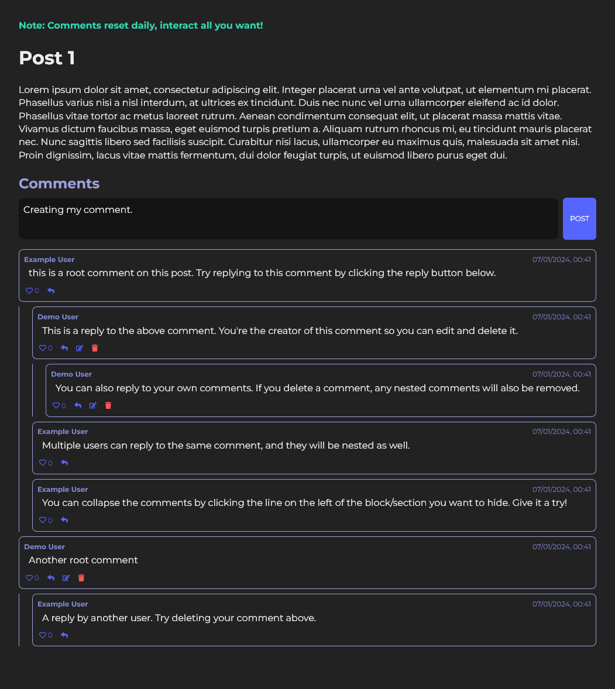
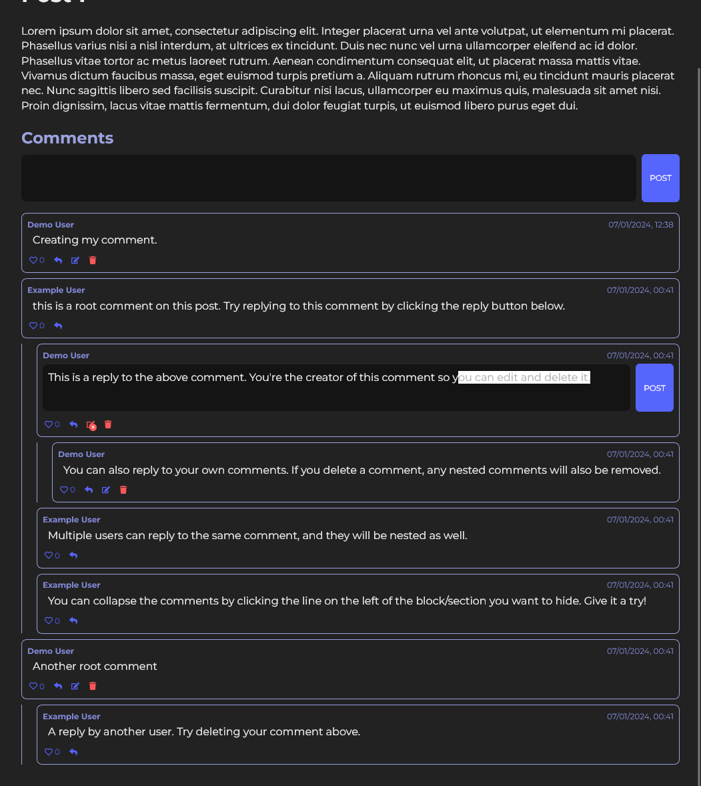
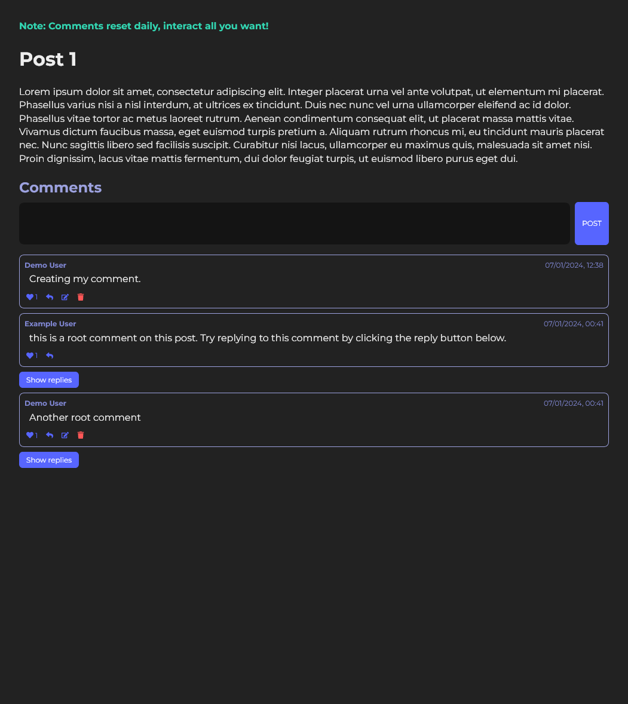

# Nested Comments

Developed by TJ Klimoski.

[Live demo](https://nested-comments-tjk.vercel.app/)
[Github](https://github.com/Tjklimoski/nested-comments)

## About Nested Comments

A demonstration of a nested commenting system that includes the ability to edit, reply, like, and delete comments. Users can also hide or show groups of nested comments.

")

## Technologies

Spotify player was built with:

- React (Next framework)
- RESTful api backend
- PostgreSQL
- Prisma ORM
- Axios
- Vercel CRON job (scheduled job)
- Javascript
- HTML
- CSS modules

## How to Run Locally

Clone repo:

    git clone https://github.com/Tjklimoski/nested-comments.git

Install dependecies:

    npm i

Add a `.env` file in the root:

    touch .env

Populate the `.env` file with your postgreSQL database connection url:

    NODE_ENV="development"

    # postgres db url
    DATABASE_URL=your_url

Then, to run locally:

    npm run dev

Application available at http://localhost:3000/
